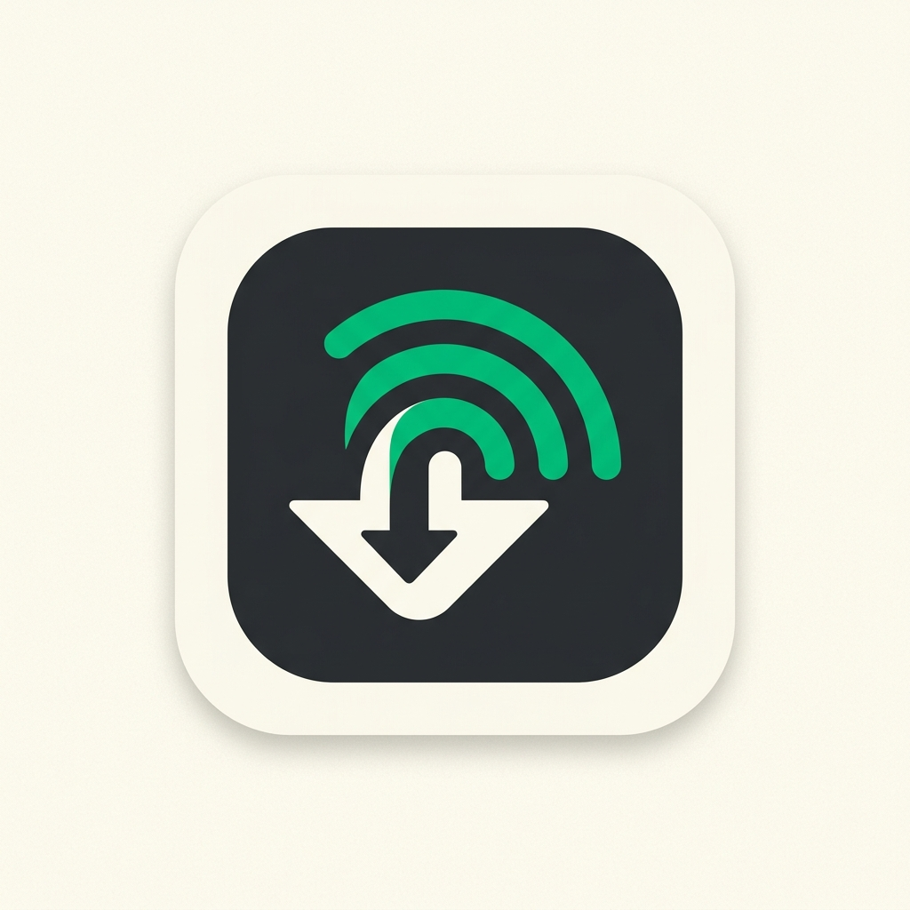

<p align="center">
  
</p>

<h1 align="center">DropIt</h1>

<p align="center">
  <strong>Lightning-Fast, Secure & Zero-Cloud Local File & Folder Sharing</strong><br>
  Built with Python, CustomTkinter, and Zero-Install Mobile Web Sharing.
</p>

<p align="center">
  <a href="#features">Features</a> •
  <a href="#quick-start">Quick Start</a> •
  <a href="#building-executable">Building .EXE</a> •
  <a href="#github-actions-cicd">GitHub Actions</a> •
  <a href="#codebase-architecture">Architecture</a>
</p>

---

## 🌟 Key Features

- **🎨 Warm Cream Retro-Tech Editorial UI**: Powered by CustomTkinter featuring rounded cards, Space Grotesk and Consolas typography, real-time speed & progress indicators, and an elegant editorial design.
- **📱 Zero-Install Mobile Web Sharing (QR Code)**:
  - **Upload to Laptop**: Scan the QR code displayed in Receive Mode on your phone (iOS/Android) to send files or full folder trees directly to your computer.
  - **Download from Laptop**: Scan the QR code in Send Mode to download files or auto-zipped folder archives straight to your phone.
- **💻 Passcode-Based Laptop-to-Laptop Pairing**: Connect desktop apps instantly using a simple 4-digit passcode without typing complex IP addresses.
- **🛡️ Universal Browser Compatibility**: Fully supports Chrome, Brave, Opera, Safari, and Firefox with preflight OPTIONS and CORS header compliance.
- **⚡ High-Throughput Network Engine**: Optimized 64 KB socket chunking delivering local transfer speeds up to **50–90 MB/s** over 5GHz Wi-Fi and Mobile Hotspots.
- **📁 Full Directory Hierarchy**: Transfer individual files or deeply nested subfolders with relative path reconstruction (`webkitdirectory` & ZIP stream support).
- **📦 Zero Memory Footprint Streaming**: Files and folders are streamed in binary chunks directly to disk without loading entire files into system RAM.

---

## 🚀 Quick Start

### Prerequisites
- Python 3.10 or higher installed.

### Installation

1. Clone the repository:
   ```bash
   git clone https://github.com/pansariji/Dropit.git
   cd Dropit
   ```

2. Install dependencies:
   ```bash
   pip install -r requirements.txt
   ```

3. Launch DropIt:
   ```bash
   python main.py
   ```

---

## 📖 How to Use

### 1. Mobile Sharing via QR Code (Zero-Install)
- **Receive from Mobile:** Click **Receive File or Folder**, open **Mobile QR**, scan the QR code with your phone camera, and select files or folders in your mobile browser.
- **Send to Mobile:** Click **Send File or Folder**, choose a file or directory, switch to **Mobile QR**, and scan the QR code with your phone to download.

### 2. Laptop-to-Laptop Transfer (Passcode Mode)
- **Receiver Laptop:** Click **Receive File or Folder** > **Laptop Passcode** tab to display the 4-digit passcode and Receiver IP.
- **Sender Laptop:** Click **Send File or Folder**, select items, switch to **Laptop Passcode**, enter the 4-digit passcode, and click **Send Now**.

> 💡 **Troubleshooting Campus / Restricted Wi-Fi (AP Isolation)**:
> University and enterprise Wi-Fi networks block peer-to-peer device scanning. You can easily bypass AP isolation by:
> 1. **Direct IP Entry**: Entering the Receiver IP manually in the Sender tab.
> 2. **Mobile Hotspot**: Turning ON phone Mobile Hotspot and connecting your laptop to it (delivers **50–80 MB/s**).
> 3. **Firewall Rule**: Ensuring Python is allowed through Windows Defender Firewall for Public & Private network profiles.

---

## 📦 Building Standalone Executable (.EXE)

DropIt can be compiled into a standalone Windows executable (`DropIt.exe`) that runs on any computer without installing Python.

To build locally using PyInstaller:
```bash
pip install -r requirements.txt
pyinstaller --noconfirm --onefile --windowed --icon=assets/logo.ico --add-data "assets;assets" --name DropIt main.py
```
The compiled executable will be saved inside the `dist/` directory.

---

## ⚙️ GitHub Actions CI/CD

DropIt includes a pre-configured GitHub Actions workflow (`.github/workflows/build.yml`). 

Whenever code is pushed to `main` or a Release tag is published, GitHub Actions automatically:
1. Provisions a clean Windows virtual machine in the cloud.
2. Sets up Python 3.11 and installs project dependencies.
3. Compiles `DropIt.exe` using PyInstaller.
4. Publishes `DropIt.exe` as a downloadable artifact under the repository's **Actions** tab.

---

## 🏗️ Codebase Architecture

```
DropIt/
├── .github/
│   └── workflows/
│       └── build.yml       # Automated GitHub Actions PyInstaller build pipeline
├── assets/
│   ├── logo.ico            # Desktop application window icon
│   └── logo.png            # High-resolution brand logo
├── config.py               # Visual theme tokens, network ports, chunk sizes & defaults
├── main.py                 # Application entry point & controller
├── requirements.txt        # Python dependency manifest
├── utils.py                # Network IP resolution, passcode generator, QR image renderer
├── p2p/                    # Laptop-to-Laptop P2P Transfer Engine
│   ├── __init__.py
│   ├── client.py           # UDP discovery broadcast & TCP file/folder streaming sender
│   └── server.py           # UDP discovery responder & TCP file/folder listener receiver
├── web/                    # Mobile Web Sharing Module
│   ├── __init__.py
│   ├── server.py           # DropItHTTPHandler (CORS/OPTIONS support), WebReceiver, WebSender
│   └── templates.py        # Embedded HTML5/CSS3/JS mobile browser interfaces
├── ui/                     # CustomTkinter Modular UI Views
│   ├── __init__.py
│   ├── home_frame.py       # Home dashboard, routing status pill, action buttons
│   ├── receive_frame.py    # Receive view (Mobile QR tab & Laptop Passcode tab)
│   └── send_frame.py       # Send view (File/Folder picker, Mobile QR tab & Laptop Passcode tab)
├── README.md               # Overview & quick start guide
└── workflow.md             # In-depth technical networking protocol & architecture specification
```

---

## 📜 License

Distributed under the MIT License. See `LICENSE` for details.
